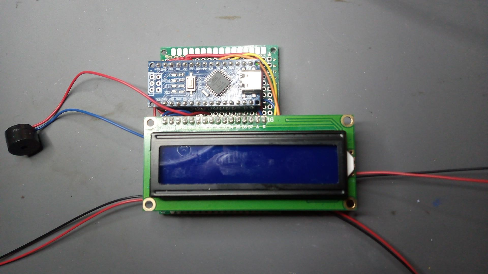
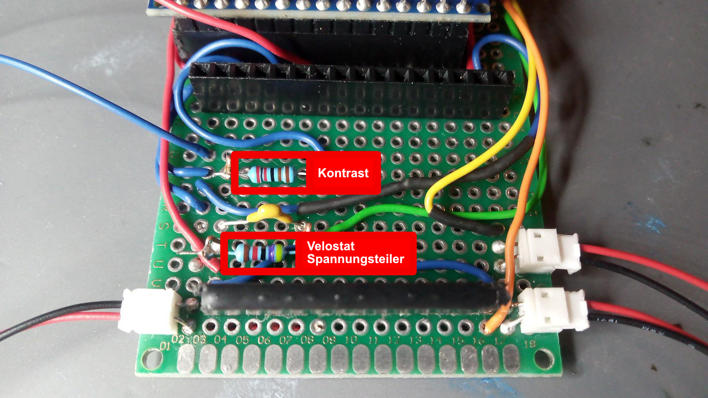

# dav_speedometer

Ein Arduino-basiertes Speedkletter-Timing mit Druckmatte, Zielkontakt, 16x2-LCD und Summer.

## Funktion

Das Programm misst eine Laufzeit fuer eine Speedwall-Anwendung:

- Die Druckmatte dient als Startsensor.
- Sobald die Matte betreten und wieder verlassen wird, startet der Timer.
- Der Zielkontakt beendet die Zeitmessung.
- Auf dem LCD werden Status, Messwerte und die laufende Zeit angezeigt.
- Ueber den Taster kann die Matte kalibriert und ein Debug-Modus aufgerufen werden.

## Bilder

### Aufbau

### Layout

### Arduino Nano Pinout

